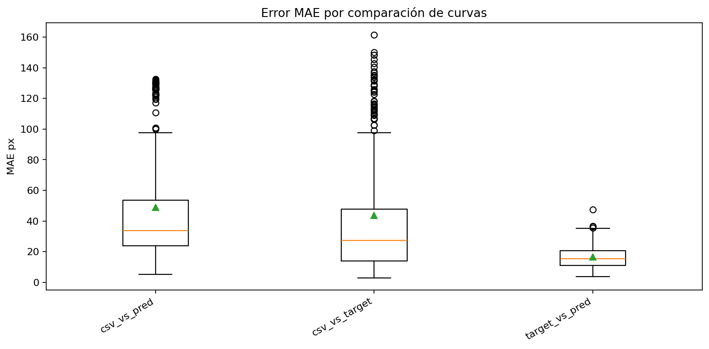
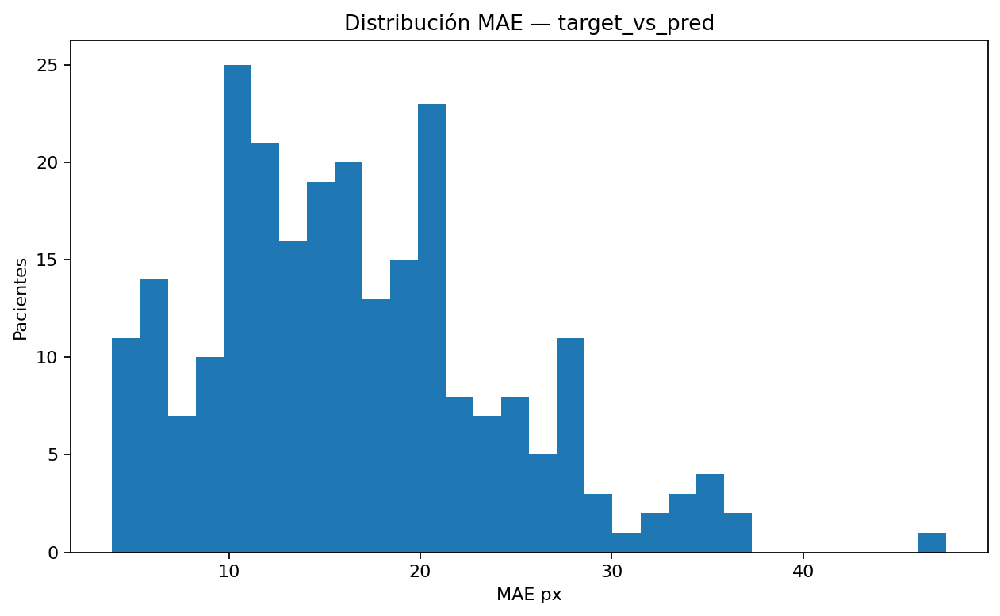
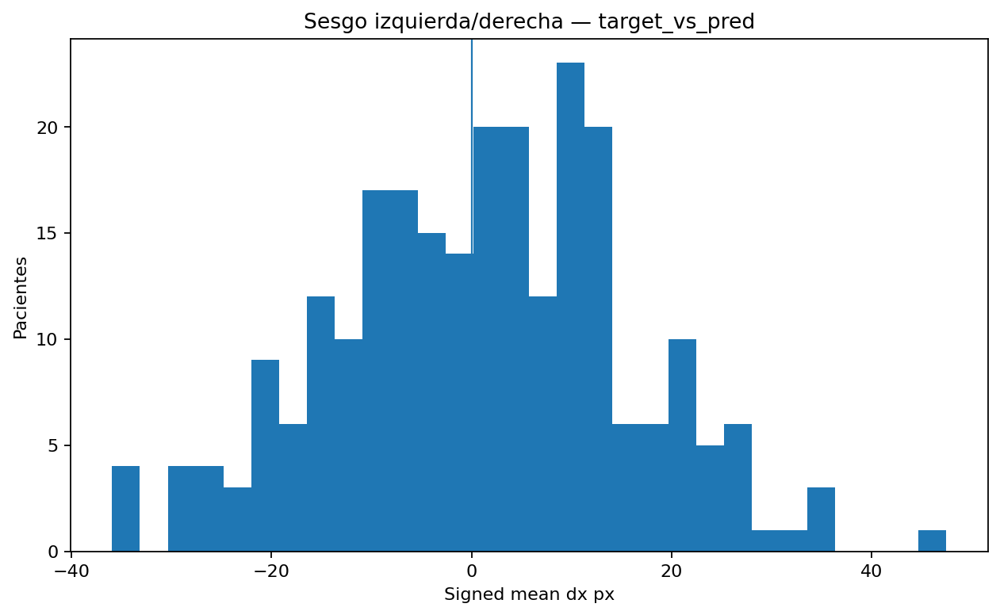
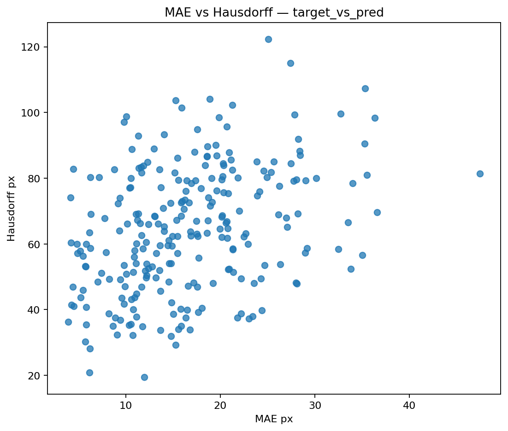
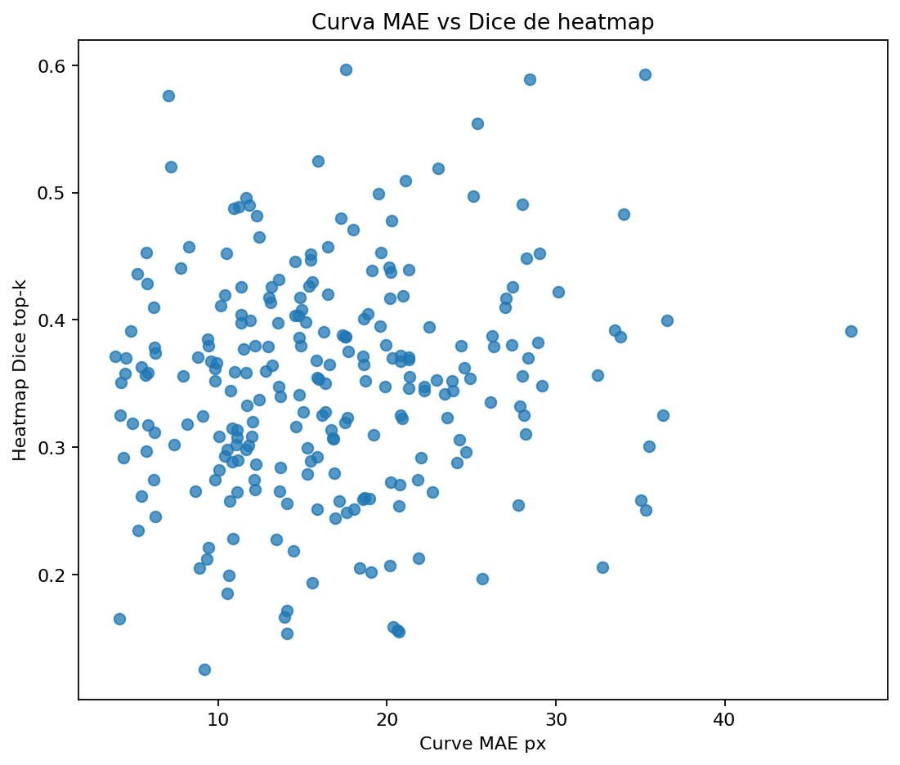
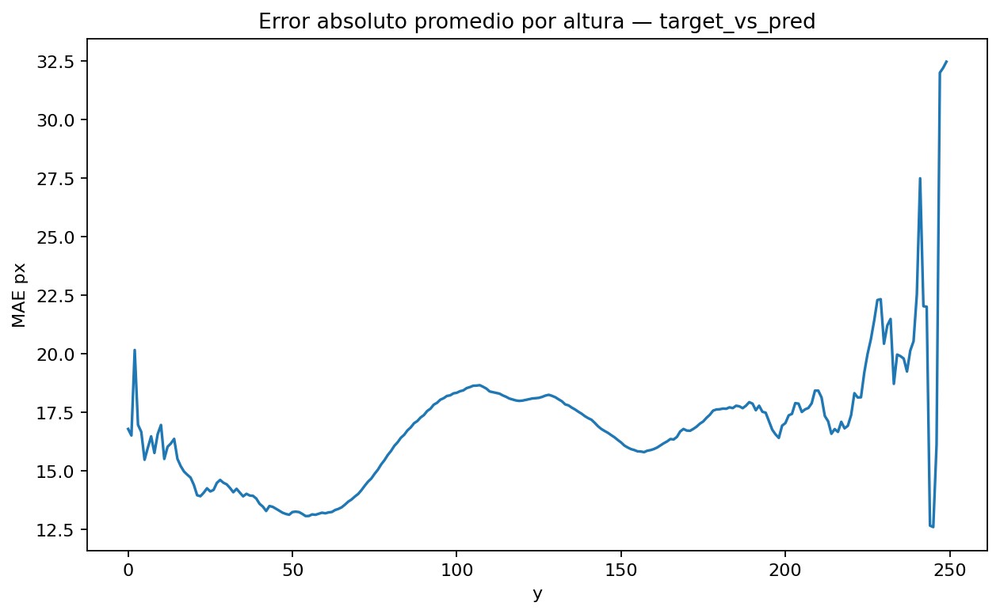
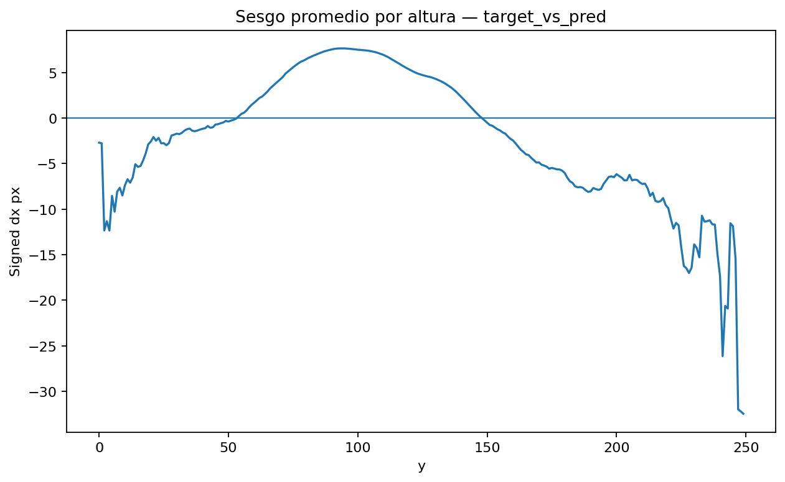
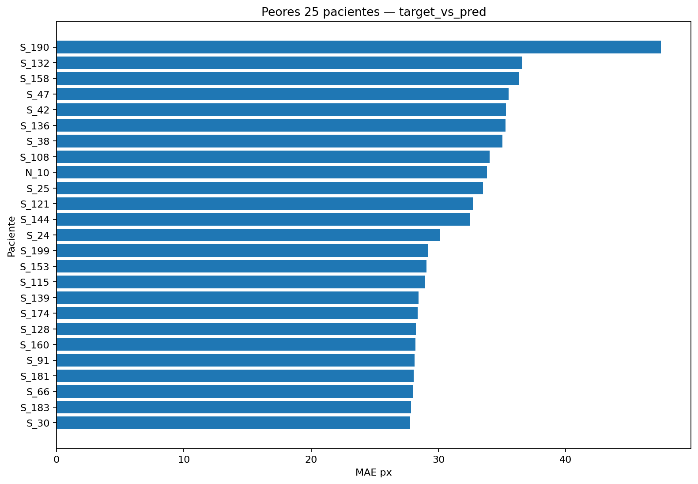

# Curve Analysis Report

## Objetivo

Comparar curvas CSV, curvas target derivadas de `y_region` y curvas predichas por la CNN.

Comparaciones principales:

- `csv_vs_target`
- `csv_vs_pred`
- `target_vs_pred`

## Métricas

- `mae_px`: error absoluto medio en pixeles.
- `rmse_px`: raíz del error cuadrático medio.
- `p95_abs_px`: percentil 95 del error absoluto.
- `signed_mean_px`: sesgo promedio; positivo significa curva comparada más a la derecha.
- `hausdorff_px`: distancia máxima entre curvas.
- `chamfer_px`: distancia promedio bidireccional entre curvas.
- `length_diff_pct`: diferencia porcentual de longitud.
- `curvature_mae`: diferencia media de curvatura.

## Resumen global

| comparison     |   n_patients |   mae_px_mean |   mae_px_median |   rmse_px_mean |   p95_abs_px_mean |   max_abs_px_mean |   signed_mean_px_mean |   mae_width_pct_mean |   hausdorff_px_mean |   chamfer_px_mean |   length_diff_pct_mean |   curvature_mae_mean |   corr_x_mean |
|:---------------|-------------:|--------------:|----------------:|---------------:|------------------:|------------------:|----------------------:|---------------------:|--------------------:|------------------:|-----------------------:|---------------------:|--------------:|
| csv_vs_pred    |          249 |       49.0192 |         33.8101 |        52.263  |           70.6988 |           72.9081 |             -7.48188  |             19.1481  |            105.252  |           49.4671 |              50.0599   |            0.144106  |      0.123932 |
| csv_vs_target  |          248 |       43.7519 |         27.3196 |        46.0692 |           60.5939 |           61.7823 |             -9.25917  |             17.0906  |             69.2852 |           40.6585 |              -0.278424 |            0.0905763 |      0.569909 |
| target_vs_pred |          249 |       16.5966 |         15.5726 |        19.3013 |           32.8033 |           35.0194 |              0.788883 |              6.48303 |             64.2998 |           18.2647 |              50.6816   |            0.100662  |      0.258247 |

## Gráficas

### 01_boxplot_mae_by_comparison



### 02_hist_target_vs_pred_mae



### 03_hist_target_vs_pred_signed_bias



### 04_scatter_mae_vs_hausdorff



### 05_scatter_curve_mae_vs_heatmap_dice



### 06_mean_abs_error_by_y



### 07_mean_signed_error_by_y



### 08_worst_25_target_vs_pred_mae




## Archivos principales

```text
tables/curve_pairwise_metrics.csv
tables/curve_rowwise_errors.csv
tables/curve_heatmap_metrics.csv
tables/curve_global_summary_by_comparison.csv
plots/*.png
patients/<patient_key>/*.png
```
