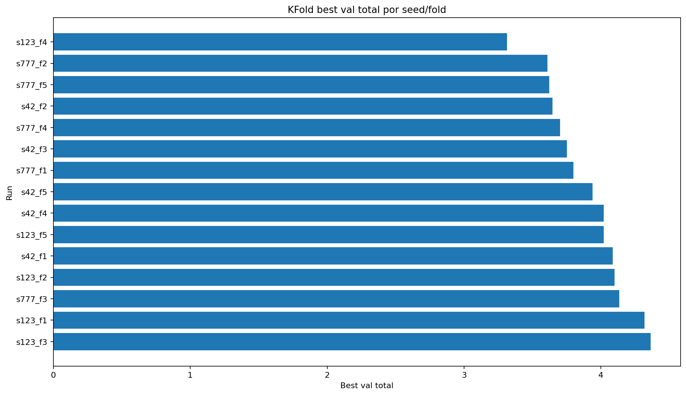

# KFold Experiment Report

Tag: `v02A_kfold_REAL_3seeds_10epochs`
Timestamp: `20260517_044750`

## Config

```json
{
  "tag": "v02A_kfold_REAL_3seeds_10epochs",
  "timestamp": "20260517_044750",
  "seeds": [
    42,
    123,
    777
  ],
  "n_splits": 5,
  "epochs": 10,
  "batch_size": 4,
  "lr": 0.0001,
  "weight_decay": 0.0001,
  "base_ch": 32,
  "dropout": 0.05,
  "n_input_channels": 2,
  "num_region_classes": 25,
  "img_h": 256,
  "img_w": 256,
  "input_filters": [
    "combined_v7"
  ]
}
```

## Summary

| seed   |   n_folds |   mean_best_val_total |   std_best_val_total |   min_best_val_total |   max_best_val_total |   mean_best_epoch |
|:-------|----------:|----------------------:|---------------------:|---------------------:|---------------------:|------------------:|
| 42     |         5 |               3.88809 |             0.184268 |              3.6468  |              4.08507 |          10       |
| 123    |         5 |               4.02283 |             0.421612 |              3.31383 |              4.36229 |           9.6     |
| 777    |         5 |               3.77214 |             0.215306 |              3.60747 |              4.13215 |          10       |
| ALL    |        15 |               3.89435 |             0.291508 |              3.31383 |              4.36229 |           9.86667 |

## Plot



## Main files

```text
tables/kfold_history_all.csv
tables/kfold_best_by_seed_fold.csv
tables/kfold_summary_by_seed.csv
plots/kfold_best_val_total_by_run.png
```
