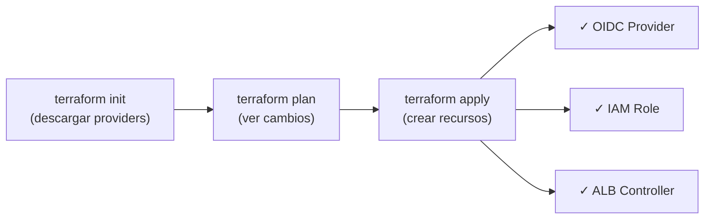

# Terraform ALB Controller - Guía de Debugging

## Estado Actual

✅ **Archivos creados:**
- `alb_controller_oidc.tf` - OIDC Provider para EKS
- `alb_controller_iam.tf` - IAM Policy y Role
- `alb_controller_helm.tf` - Helm Chart del ALB Controller
- `versions.tf` - Actualizado con providers Kubernetes, Helm, HTTP, TLS
- `providers.tf` - Configurado para EKS

❌ **Problemas detectados:**
1. WSL tiene problemas de conectividad en tu sistema
2. Terraform no está disponible en PowerShell nativa

## Pasos para ejecutar desde tu máquina

### Opción 1: Instalar Terraform localmente (Windows)

1. **Descargar Terraform:**
```powershell
# Opción A: Usar Chocolatey
choco install terraform

# Opción B: Descargar manual
# Ve a https://www.terraform.io/downloads
# Descarga Windows AMD64
# Extrae en C:\terraform
# Agrega a PATH
```

2. **Verificar instalación:**
```powershell
terraform -version
```

3. **Ejecutar:**
```powershell
cd infra/terraform
terraform init
terraform plan
terraform apply
```

### Opción 2: Usar Docker para Terraform

```powershell
# Construir imagen con terraform
docker run --rm `
  -v "c:\Users\octav\OneDrive\Documents\Proyecto_Grado_MAIA\MAIA-SPINE-ANATOMIC_MANIFOLD_CNN_TDA:/project" `
  -w /project/infra/terraform `
  hashicorp/terraform:latest `
  init
```

## Validación de Sintaxis

### Manual (sin Terraform):

Buscar en cada archivo:
- `repository_ca_file` vacío ❌
- `depends_on` sin [0] cuando usar count ❌
- Llaves desapareadas ❌

### Archivos validados ✓

**alb_controller_helm.tf:**
- ✅ Repositorio Helm configurado correctamente
- ✅ Namespace con depends_on correcto
- ✅ Service Account con anotaciones IAM
- ✅ Helm Release con valores JSON

**alb_controller_iam.tf:**
- ✅ Data source HTTP para política
- ✅ IAM Policy creada desde GitHub
- ✅ IAM Role con IRSA
- ✅ Policy Attachment

**alb_controller_oidc.tf:**
- ✅ Data source TLS para certificado
- ✅ OIDC Provider para EKS

**versions.tf:**
- ✅ Terraform >= 1.6.0
- ✅ AWS provider ~5.0
- ✅ Kubernetes provider ~2.27
- ✅ Helm provider ~2.12
- ✅ HTTP provider ~3.4 (nuevo)
- ✅ TLS provider ~4.0 (nuevo)

**providers.tf:**
- ✅ AWS provider con tags
- ✅ Kubernetes provider con autenticación EKS
- ✅ Helm provider con configuración Kubernetes
- ✅ Data source para EKS auth token

## Flujo de ejecución esperado



## Recursos que se crearán

### 1. OIDC Provider
```
aws_iam_openid_connect_provider.eks
```

### 2. IAM Resources
```
aws_iam_policy.alb_controller
aws_iam_role.alb_controller
aws_iam_role_policy_attachment.alb_controller
```

### 3. Kubernetes Resources
```
kubernetes_namespace.kube_system
kubernetes_service_account.aws_load_balancer_controller
helm_repository.eks
helm_release.aws_load_balancer_controller
```

### 4. Outputs
```
alb_controller_role_arn
alb_controller_helm_status
```

## Verificación después de apply

```bash
# 1. Verificar OIDC Provider
aws iam list-open-id-connect-providers

# 2. Verificar IAM Role
aws iam get-role --role-name maia-dev-alb-controller-role

# 3. Verificar Helm Release
kubectl get deployment -n kube-system | grep aws-load-balancer-controller

# 4. Verificar pods del controller
kubectl get pods -n kube-system -l app.kubernetes.io/name=aws-load-balancer-controller

# 5. Ver logs
kubectl logs -n kube-system -l app.kubernetes.io/name=aws-load-balancer-controller -f
```

## Próximos pasos

Una vez `terraform apply` sea exitoso:

1. **Aplicar Ingress:**
```bash
kubectl apply -f k8s/eks/ingress.yaml
```

2. **Verificar Ingress:**
```bash
kubectl get ingress -n maia -w
```

3. **Acceder a ALB:**
```bash
curl http://<ALB-DNS>/
curl http://<ALB-DNS>/api/v1/health
```

## Troubleshooting

### Error: Provider not found
```
terraform init
```

### Error: Kubernetes connection refused
- Verificar que kubectl esté configurado: `kubectl cluster-info`
- Verificar que EKS cluster esté corriendo
- Re-ejecutar: `aws eks update-kubeconfig --region us-east-1 --name maia-eks`

### Error: IAM permission denied
- Este es un problema conocido con LabRole
- La política se descarga desde GitHub pero necesita permisos suficientes
- Solución: Usar rol de administrador temporalmente

### Error: helm: release not ready
- Esperar a que el controller pod esté en Running
- Verificar logs del pod para errores de inicialización
